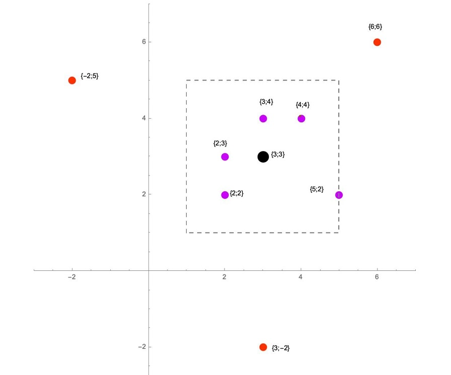

## Task description ##

Implement the [GetNeighbors](GetNeighbors/CartesianCoordinates.cs#L16) method, which returns from a set of `points` only points that are `h`-neighbors for a point with integer coordinates `x` and `y`. The point is represented by structure [Point](GetNeighbors/Point.cs#L6).

The point `neighbor(xNeighbor, yNeighbor)` is `h`-neighbor for the given `point(x, y)` with a distance `h > 0` if the coordinates of these points are such that `|xNeighbor - x|<=h` and `|yNeighbor - y|<=h`. The points resulting from sorting should not be sorted (in arbitrary order).      

      
*Topics - structs, arrays, keyword params, equivalence relation.*